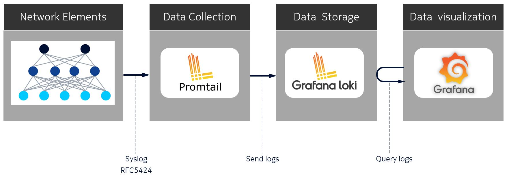
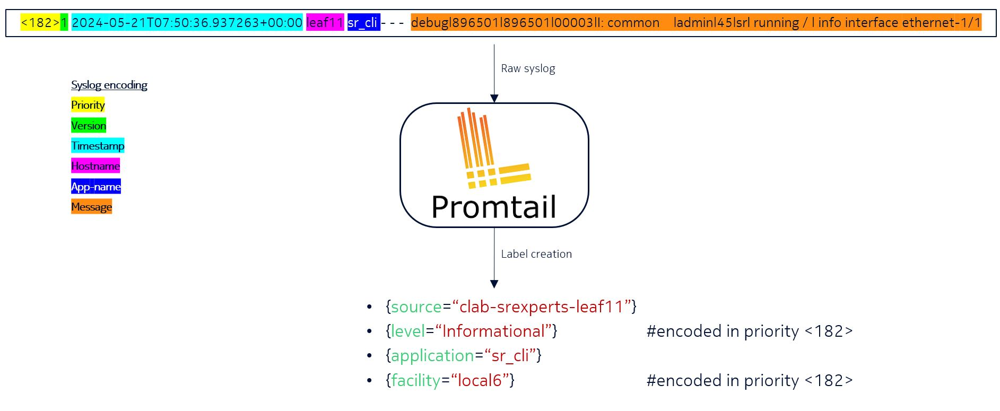
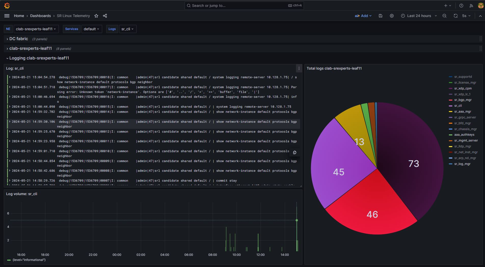

# SR Linux remote logging with Loki

In today's rapidly evolving network environments, maintaining robust and efficient operations is more critical than ever. Remote logging plays a pivotal role in achieving this by providing a comprehensive and centralized method for monitoring, analyzing, and troubleshooting network activities across diverse and distributed systems. This can be achieved by using a logging stack consisting of a syslog collector [Promtail](https://grafana.com/docs/loki/latest/send-data/promtail/), a database for central log storage [Loki](https://grafana.com/docs/loki/latest/) and a visualization [Grafana](https://grafana.com/docs/grafana/latest/) tool for querying and analyzing data.

On a high level, SR Linux will send syslog messages according to [RFC5424](https://datatracker.ietf.org/doc/html/rfc5424) to Promtail which is repsonsible for collecting the logs. Promtail will create additional labels assotiated to the logs and pass it through to the database Loki. Grafana can then query the logs based on the labels assiciated to them.



## Deploying the lab

The lab is deployed with the [containerlab](https://containerlab.dev) project, where [`st.clab.yml`](st.clab.yml) file declaratively describes the lab topology.

```bash
# change into the cloned directory
# and execute
containerlab deploy --reconfigure
```

To remove the lab:

```bash
containerlab destroy --cleanup
```

## Accessing the network elements

Once the lab has been deployed, the different SR Linux nodes can be accessed via SSH through their management IP address, given in the summary displayed after the execution of the deploy command. It is also possible to reach those nodes directly via their hostname, defined in the topology file. Linux clients cannot be reached via SSH, as it is not enabled, but it is possible to connect to them with a docker exec command.

```bash
# reach a SR Linux leaf or a spine via SSH
ssh admin@clab-loki-leaf1
ssh admin@clab-loki-spine1

# reach a Linux client via Docker
docker exec -it clab-loki-client1 bash
```

## Configure logging on SR Linux
Let's start from the beginning of our data pipeline and configure logging on SR Linux nodes.

Nokia SR Linux Network OS design employs a high level of granularity where each service is represented as a standalone process with a messaging bus enabling inter-process communication. These processes implement logging via the standard Linux syslog interface. In particular, SR Linux uses a well-known rsyslog server to manage syslog messages in the underlying Linux OS.

Basic logging configuration consists of specifying a source for input log messages, filtering the log messages, and specifying an output destination for the filtered log messages.

Messages logged to Linux syslog [facilities](https://documentation.nokia.com/srlinux/24-3/books/config-basics/logg.html#input-sources-log-messages__ai9ep6mg6y) and messages generated by SR Linux [subsystems](https://documentation.nokia.com/srlinux/24-3/books/config-basics/logg.html#input-sources-log-messages__ai9ep6mg6z) can be used as input sources for log messages. You can find a list of those facilities and subsystems in the documentation.
When defining a Linux OS facility or SR Linux subsystem as a log source, users can provide a priority param that narrows the capture to a given severity, a range, or a specific set of severities.

A destination for the ingested and filtered log messages can be one of the following:

* **local log file**: a file on disk that can be configured with retention policies.
* **buffer**: an in-memory file.
* **console**: console output.
* **remote**: remote server.

In the course of this lab exercise, we will work with a `remote-destination` output type, as we intend to send the log messages over to Promtail.

With a basic understanding of how to configure logging on SR Linux, let's see what does logging configuration look like. Here is an example:

```sh
--{ + running }--[  ]--
A:leaf11# system logging

--{ + running }--[ system logging ]--
A:leaf11# info
    network-instance mgmt
    #<snippet>
    remote-server 10.128.1.75 {
        transport udp
        remote-port 1514
        subsystem aaa {
            priority {
                match-above informational
            }
        }
        subsystem acl {
            priority {
                match-above informational
            }
        }
        # other subsystems snipped here for brevity
        subsystem vxlan {
            priority {
                match-above informational
            }
        }
    }
```

Now log into `clab-srexperts-leaf11` and navigate to the `system logging remote-server 10.128.1.75` context. With the `info` command you can see what is configured in this conext. Compare the configuration with the example above. What do you notice?

```
--{ + running }--[  ]--
A:leaf11# system logging remote-server 10.128.1.75

--{ + running }--[ system logging remote-server 10.128.1.75 ]--
A:leaf11# info detail
    transport udp
    remote-port 1514
    facility local6 {
        priority {
            match-above informational
        }
    }
```

You should notice we don't define individual [subsystems](https://documentation.nokia.com/srlinux/24-3/books/config-basics/logg.html#input-sources-log-messages__ai9ep6mg6z) here, but only define a facility `local6` matching informational level priority and above. By default, SR Linux subsystem messages are logged to Linux syslog facility `local6`, which gives us a configuration efficiency if we want to capture all.

### Log format
Consider the following example of syslog-formatted messages of the `chassis` subsystem that can be seen on SR Linux:
```bash
2024-05-17T20:27:21.252868+00:00 leaf11 local6|NOTI sr_chassis_mgr: chassis|1476|1476|00122|N: The subinterface ethernet-1/50.0 is now up
2024-05-17T20:27:23.630370+00:00 leaf11 local6|NOTI sr_chassis_mgr: chassis|1476|1476|00123|N: Interface lag1 is now up
2024-05-17T20:27:23.630388+00:00 leaf11 local6|NOTI sr_chassis_mgr: chassis|1476|1476|00124|N: The subinterface lag1.1 is now up
2024-05-17T20:27:23.630494+00:00 leaf11 local6|NOTI sr_chassis_mgr: chassis|1476|1476|00125|N: The subinterface lag1.101 is now up
```

Log message format that is used by rsyslog when sending to remote destination has the following signature:
```
<TIMESTAMP> <HOSTNAME> <FACILITY>|<SEVERITY> <APPLICATION>: <SUBSYSTEM>|<PID>|THREAD_ID|SEQUENCE|<SEVERITY>: <MESSAGE> 
```
where
```
<TIMESTAMP>   - Time in format - MMM DD HH:MM:SS.
<HOSTNAME>    - SR Linux hostname.
<APPLICATION> - SR Linux application name, in the context of Syslog this is the Message ID.
<SUBSYSTEM>   - SR Linux subsystem name, which is configured under /system/logging/remote-server 
<PID>         - Process ID.
<THREAD_ID>   - Thread ID.
<SEQUENCE>    - Sequence number, which allows to reproduce order of the messages sent by SR Linux.
<SEVERITY>    - A singe char indicating criticality of the message (I - informational, W - warning, etc.)
<MESSAGE>     - Application free-form message that provides information about the event, that could contain network-instance name, like "Network-instance default".
```

<details>
<summary>Dumping syslog messages sent to the remote-server?</summary>
<br>
The format that rsyslog uses to send log messages to the remote destination differs from the default format used for buffer and file destination.

To see the messages on the wire as they are being sent towards a remote syslog collector users can leverage tcpdump tool available on SR Linux:
```
--{ running }--[  ]--
A:leaf1# bash 
[admin@leaf11 ~]$ tcpdump -vAnni any dst 10.128.1.75
tcpdump: listening on any, link-type LINUX_SLL2 (Linux cooked v2), snapshot length 262144 bytes

07:50:36.937551 mgmt0.0 Out IP (tos 0x0, ttl 64, id 10656, offset 0, flags [DF], proto UDP (17), length 182)
    10.128.1.33.48501 > 10.128.1.75.1514: UDP, length 154
E...).@.@..+..!..K.u....zj<182>1 2024-05-21T07:50:36.937263+00:00 leaf11 sr_cli - - -  debug|896501|896501|00003|I: common    |admin|45|srl running / | info interface ethernet-1/1
```
</details>

## Promatil
Now we are at a point when a raw syslog message has been generated by SR Linux and sent towards its first stop - Promtail. Promtail will take the raw syslog and generate additional labels associated to the log entry. You can find the Promtail configuration file [here](../../clab/configs/promtail/promtail-config.yml). Let's have a closer look and break it down a bit. 

This section specifies where Promtail should send the logs. In this case, it's sending logs to a Loki instance.
```yaml
clients:
  - url: http://loki:3100/loki/api/v1/push
```

Here we define Promtail to be used as a syslog collector. It listens to any IP address on UDP port 1514 and generates a stattic label `syslog` which will me applied to all log entries. 
```yaml
scrape_configs:
  - job_name: syslog
    syslog:
      listen_address: 0.0.0.0:1514
      listen_protocol: udp
      idle_timeout: 300s
      label_structured_data: yes
      labels:
        job: "syslog"
```

Relabel configs is used to manipulate or add labels to the log entries. These labels can be very useful when query them from the Loki database. In the example below we manipulate only one label - the `source` label. `source_label` extracts a value from the specified field in the syslog message, in this case the `hostname`, and replaces it with `clab-srexperts-$1` and applies it to the `target_label` `source`. 
```yaml
scrape_configs:
    #<snippet>
    relabel_configs:
      - source_labels: ["__syslog_message_hostname"]
        replacement: clab-srexperts-$1
        target_label: "source"
      - source_labels: ["__syslog_message_severity"]
        target_label: "level"
      - source_labels: ["__syslog_message_app_name"]
        target_label: "application"
      - source_labels: ["__syslog_message_facility"]
        target_label: "facility"
      - source_labels: ["__syslog_message_proc_id"]
        target_label: "procid"
```



## Loki
Time to navigate loki and query some logs based on the label created by Promtail. Log into the Grafana dashboard with `admin`/`SReXperts2024` credentials. 

(\*_connect using the instructions below before moving on_)

> To be able to view the [grafana](https://grafana.com) dashboard on your laptop, use ssh forwarding: \
> `ssh -NL 3000:10.128.<lab id>.73:3000 <user>@<lab server>`\
> Now you can access the [grafana](https://grafana.com) dashboard at: [http://127.0.0.1:3000](http://127.0.0.1:3000)

1. Go to the `burger menu` top left corner
2. Click on Explore
3. Select Loki as data source
4. In `Label filter` select label `source` with value `clab-srexperts-leaf11`
5. Click `Run query`
6. You should now see all the log related to `clab-srexperts-leaf11`
7. Add a extra search label by clicking on `+`
8. In `Label filter` select label `application` with value `sr_cli`
9. You should now see all cli activity on `clab-srexperts-leaf11`


## Grafana
Users have the posibility to implement Loki logs into Grafana dashboards. Have a look into the `SR Linux Telemetry` dashboard. 




